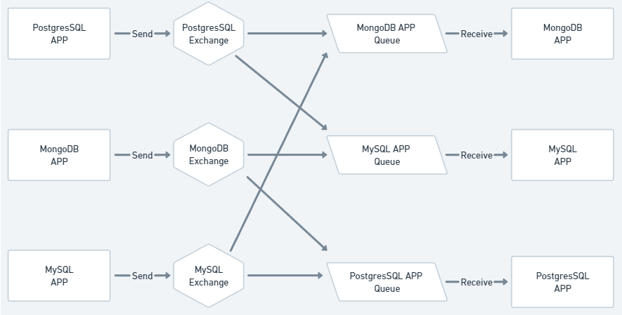

<h1 align="center">Database Synchronization</h1>

<p align="center">
  <a href="#dart-about">About</a> &#xa0; | &#xa0;
  <a href="#rocket-technologies">Technologies</a> &#xa0; | &#xa0;
  <a href="#how-the-problem-was-solved">Solution</a> &#xa0; | &#xa0;
  <a href="#white_check_mark-requirements">Requirements</a> &#xa0; | &#xa0;
  <a href="#checkered_flag-starting">Starting</a> &#xa0; | &#xa0;
  <a href="#api-documentation">API Doc</a> &#xa0;
</p>

<br>

## :dart: About

The objective of this project is to synchronise the databases of three independent Golang Web APIs. Each API manages its own data and creates users independently through its endpoints. However, to ensure data consistency, a background synchronization process is initiated every 30 seconds to replicate the latest users created across all databases.

Rather than sending each new user straight to the appropriate exchange, i attempted to emulate a batch process where the applications wait for a specified period (30 seconds) and then send an array of new users to be processed by other applications.

## :rocket: Technologies

The following tools were used in this project:

- [Golang](https://go.dev/)
- [RabbitMQ](https://www.rabbitmq.com/)
- [Docker](https://www.docker.com/)
- [MySQL](https://www.mysql.com/)
- [PostgresSQL](https://www.postgresql.org/)
- [MongoDB](https://www.mongodb.com/)

## How the problem was solved

The synchronization problem was solved using RabbitMQ and creating users ID (UUID) in application level to keep the same IDs through different applications.

The use of RabbitMQ was extremely important because of the exchanges and queues it provides us.

Setting the exchanges as "fanout" makes possible to send the data to all of the queues that are bound to it. Enabling an application send its data to other applications.

### What happens if the queue receives a user that has already been created in the database ?

This shouldn't happen, but if it does, the received user won't be created again because users ID are primary keys, the downside would be processing an already created user.

## The following image shows how the data is being shared between applications



As you can see, each application queue receives data from the other applications exchanges, enabling synchronization.

## :white_check_mark: Requirements

If you would like to test the project, before starting :checkered_flag:, you need to have [Golang](https://go.dev/) and [Docker](https://www.docker.com/) installed.

## :checkered_flag: Starting

```bash
# Clone this project
$ git clone https://github.com/BernardoDenkvitts/Database-Synchronization

# Access
$ cd Database-Synchronization

# To start databases and rabbitmq
$ docker-compose up --build -d

# Starting each application

# Mongo APP
$ cd MongoAPP
$ go run .\cmd\main.go

# MySQL APP
$ cd MySQLAPP
$ go run .\cmd\main.go

# PostgresAPP APP
$ cd MySQLAPP
$ go run .\cmd\main.go

# MySQLAPP will initialize in http://localhost:8080
# Mongo APP will initialize in http://localhost:8181
# PostgresAPP will initialize in http://localhost:8282
```

## API Documentation

### Base URL

`http://localhost:{port}/{database}/user/`

### /{database} options

    * mysql
    * mongo
    * postgres

### Erros

This API uses the following error codes:

- 400 Bad Request: The request was malformed
- 404 Not Found: The requested resource was not found.
- 500 Internal Server Error: An unexpected error occurred on the server.

## Error response

    {
      "status": int,
      "response": string
    }

## Create user

`POST /create`

### Request

    {
        "firstName": string,
        "lastName": string
    }

### Response

    HTTP/1.1 201 CREATED
    Date: Wed, 17 Jul 2024 03:08:28 GMT
    Content-Type: application/json
    Status: 201 CREATED
    Uri: /{database}/user/{userId}
    Content-Length: 36

    {
      "status": 201,
      "response": "Created"
    }

## Get user

`GET /create/{userId}`

### Response

    HTTP/1.1 200 OK
    Date: Wed, 17 Jul 2024 03:08:28 GMT
    Content-Type: application/json
    Status: 200 OK
    Content-Length: 36

    {
      "status": 200,
      "response": [
        {
          "id": string,
          "firstName": string,
          "lastName": string,
          "createdAt": timestamp
        }
      ]

}

## Get users

`Base URL`

### Response

    HTTP/1.1 200 OK
    Date: Wed, 17 Jul 2024 03:08:28 GMT
    Content-Type: application/json
    Status: 200 OK
    Content-Length: 155

    {
      "status": 200,
      "response": [
          {
              "id": string,
              "firstName": string,
              "lastName": string,
              "createdAt": timestamp
          }
      ]
    }

<a href="#top">Back to top</a>
